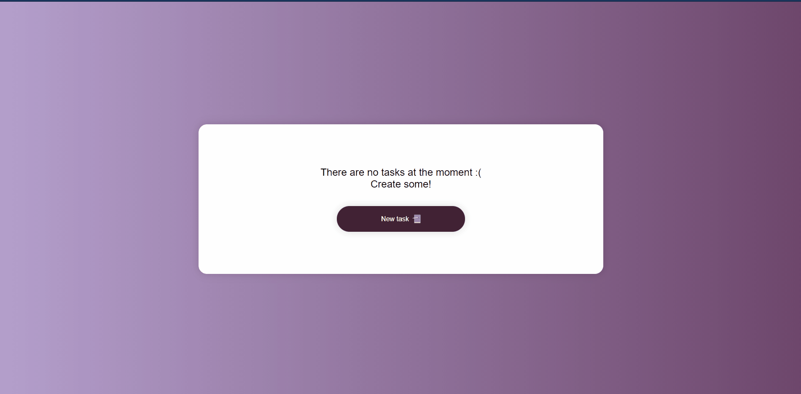
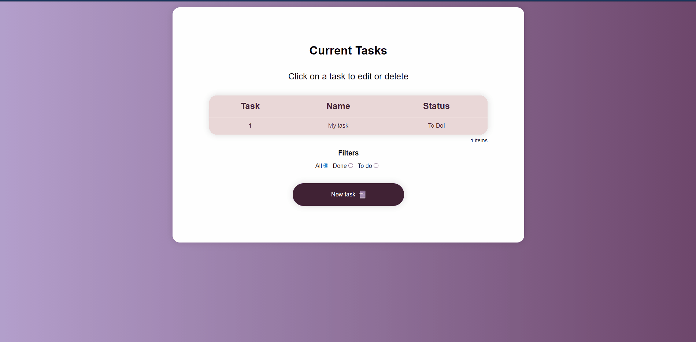

<!---->

<!---->

<h1>bright-cities-todo</h1>

<h2>A Todo list web application using the Django Framework and PostgreSQL database.</h2>

<!--Project's Goal-->

<h2>🤔 Project's Goal 🤔</h2>

This project is a To Do list web application, where users can create, read, update and delete their tasks. Basically, a CRUD kind of application. 
With a simple and nice interface, users can easily administrate their 'to do' tasks and never get disorganized!

<!--Technologies-->

<h2>💻 Technologies 💻</h2>

The technologies used to built this project were:

- Python
- Django
- PostgreSQL
- HTML
- CSS
- Javascript

In the <a href="./requirements.txt" target="_blank">requirements.txt</a> file you can find all the libraries and dependencies for the Python language.

<!--Deploy and Demo-->

<h2>🚧🚦 Deploy | Demo 🚦🚧</h2>

This project was deployed on the Heroku cloud service, and you can access the demo of it <a href="https://bright-cities-todo.herokuapp.com/" target="_blank">here</a>. 
Also, in order to have the best experience using the application, try to open it on either a desktop or notebook, because i haven't optimized the responsiveness for mobile devices yet, but i will do so soon.

<!--Screens-->

<h2>👻 App screens 👻</h2>

This web application is divided by the operations that exists within the code:

- Creating a task
- Listing the task(s)
- Updating and deleting the tasks

First, if there aren't any tasks registered in the database, the following screen will be displayed:

<h2>Creating a task</h2>

When the 'New task' button is pressed, the user will be able to create a new task. There are a few things to notice:

- The task name field is not optional and it can have a length up to 25 characters;
- The task's description is optional and it can have a length up to 255 characters;

Bellow we can see the process of creating a task.

<h2>Listing the tasks</h2>

After a successful task registration, the user will be redirected to the home page, which will now show the tasks that are stored in the database. By default, every new task is checked as 'To Do'. Check out bellow how the tasks are displayed.

<h2>Updating the tasks</h2>

Now that we have some tasks stored, if the user clicks on any of the tasks that are listed, the application will redirect the user to the page where he/she can both update and delete the task that was selected. 
Bellow we can see the update process.

<h2>Deleting the tasks</h2>

And finally, we can do the same process, select a task of the list and choose the 'delete' option. This will delete the selected task from the database. 
Check the delete process bellow.

Also, after every successful update and delete, the user will be redirected to the home page, which is dynamic, meaning that if there are any task in the database, it will show them, otherwise, it will show a nice message instead.

<!--Author-->

<h2>👾 Author 👾</h2>

Made with ❤ by <a href="https://github.com/firminoneto11" target="_blank">Firmino Neto</a>.
